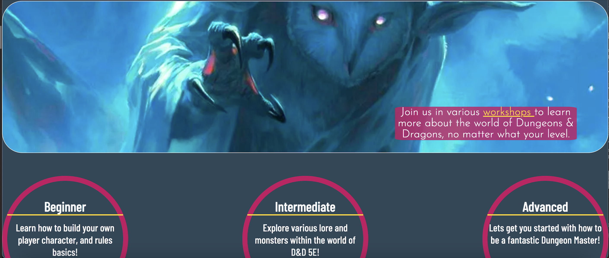
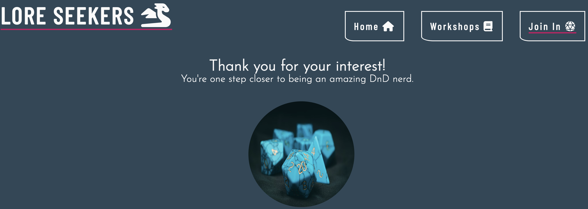
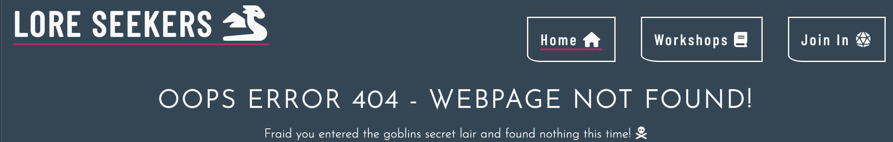

# Lore Seekers

Welcome to the world of DnD workshops run by Lore Seekers - [you can find the live version here.](https://annadobrucki.github.io/Lore-Seekers/) 

## Index

* [Project Goals](#project-goals)
* [Features](#features)
* [Design](#design)
* [Testing](#testing)
* [Deployment](#deployment)
* [Credits](#credits)

This website allows users with easy access to any and all potential workshops they may be curious about. This is aimed at people of all ages who are wanting to be creative and put themselves out there for a role-playing game that at times can feel overwhelming. 

## Project Goals

Understanding this feeling of being overwhelmed, it was imperative to make the website as eye-catching, simple and easy to use as possible.
Knowing the world of Dungeons & Dragons as I do, it is easy to feel like there are ‘gatekeepers’ to the subject, and it comes with a heavily introverted society. To counter this I created a website that;
- Has bite sized and direct tidbits of information.
- Provides essential info regarding the various workshops.
- Easy to find sign up form, which is quick and straight forward.
- Has outreach for a variety of people over multiple spectrums.
- Entices newcomers without fear, shows knowledge for those coming with more experience. 
- Guides the user to where and when these workshops would take place.  

## Features

I enacted multiple features to help streamline user experience on this site. Through-out the website there are call’s to action to guide the user to find out more about the workshops, and eventually sign up for one of them. 

+ Nav Bar 
  * I did this by creating a Nav bar that allows the user to know where they are at all times through-out there use. Embedding links to each workshops, in the Home section. As well as links to the _Join Us_ page. 

+ Landing Page
  * The landing page has a bold hero image and a one use animation for cover text, this was used as an eyecatching feature so the first element users read is about *workshops* and *DnD*. In addition for better user expereience I created workshop badges that you begin to see at the bottom of the screen, so the user can infer that there is more content below.

+ Workshops Page
  * After the landing page most links are heading towards the workshops page. Here there are a multitude of YouTube Videos, and "short and sweet" breakdowns of each workshop, and there affiliated time slots. I added the videos with the forethought, that newcomers would like to have some basic knowledge about DnD before entering a new space, with new people. Linking those pages are embedded links to the Join.In page. 
    * [Beginner](https://youtu.be/BgvHNlgmKro)
    * [Intermediate](https://www.youtube.com/embed/ng8sPnaMLUY)
    * [Advanced](https://www.youtube.com/embed/ANdG2DGm0CQ)

+ Join In Page 
  * Here users are greeted with a simple yet effective sign up sheet, making calls to action to fill in required fields, that, if not fully completed the page will not _Submit_ there choices. 
  

+ Thank You page 
  * This was in fact reccomeneded by my mentor Gareth McGirr. My original idea had the PUSH action to a code institute form-dump page. However under the suggestion of my mentor, I created a page that greets the user with a Thank you, and D20 image (well known as a good omen in DnD). This allows the user to still remain on my site instead of being pushed somehwere else. 

+ Footer
  * I also created a footer bar. Consisting of two blocks, one that allows the user to Contact Us for any further info. The other a Visit Us to all the relevant social media links for Lore Seekers. I also inserted a [Google Maps iframe straight to the workshops venue](https://www.google.com/maps?ll=51.495359,-0.099585&z=15&t=m&hl=en&gl=GB&mapclient=embed&cid=3226506455862106501) allowing the user easy knowledge of where and how to get to the venue. I spoke with my mentor who suggested having a larger map would be better for user experience, however I asked some friends and family about what they prefered. The overall consensus was, people dont use embedded maps on websites anymore, they simply click and follow the link to the relevant map. With this in mind I broadened the map a touch and kept the overall style as it is now. 

  

+ Error 404 page

  * I created an error 404 page to make sure users can always remain on my site, and be helpful to re-direct them back to the site. 
   

 ### Design
   1. Color Scheme.
    - Although Dungeons and Dragons are well known for there black and red hues', I wanted a color scheme that was tangental to its original. I used [*My Color.Space*](https://mycolor.space/?hex=%23EA0661&sub=1) to generate a color scheme that worked for me. Playing around with pinks/ blues and whites. With the addition of gold to really stand out and help for accessability users. After that I used [RGB Color picker](https://rgbacolorpicker.com/hex-to-rgba ) to convert my colors of choice to RGBA for me. 

   2. Fonts.
    - Again the Font of most DnD books or stories has its own well renowned font (even used for the title credit of Stranger Things), so I wanted to steer clear of copywrite probelms and make something less harsh, and preferably enjoyable to read. Thanks to [Google Fonts](https://fonts.google.com/), I managed to have both a bold font for important information, and a lighter weighted one of Josefin-Sans that has a more fantastical nature to it. 

   3. Wireframes.
    - I constructed the page idea in my head and placed it on paper at first, which I then transposed onto a wireframe. 
    To help me visualise my website before I got to coding I used [Balsamiq](https://balsamiq.com/wireframes/?gclid=CjwKCAiAwomeBhBWEiwAM43YIKDLVpSTbTPGdANYmNtCBIQFrCBalOw9J1Hy3rXIXJycnkIxDYr8ahoCwtEQAvD_BwE).
   Here are the wireframe protoypes for the website: 
  

  

  

   4. Images and Logos
    -   All images used in the project were downloaded from places with a free license and don't need purchasing. I used various websites such as [Font Awesome](https://fontawesome.com/icons/dragon?s=solid&f=classic) to help me build my Logo, in conjuction with [Favicon](https://favicon.io/favicon-generator/) which allowed me to build a logo. Along with [Shutterstock](https://www.shutterstock.com/discover/stock-assets-uk-0220?c3apidt=p46848462172&gclid=CjwKCAiAwomeBhBWEiwAM43YIM5L464Bmpb0amVcJtesyh3q18-5F7s_RQoGkoEsgP13dKoUwrTQVRoC3KIQAvD_BwE&gclsrc=aw.ds&kw=free%20images%20download), [Unsplash](https://unsplash.com/), and [Pexels](https://www.pexels.com/) for my inspiration and images.
      * Note Creditation *Favicon* - there creation was also the code I used to embedd the logo into my site/ tab bar. 

# Testing

  ### Please find all notes relating to testing [here](documentation/testing.md).

# Deployment

Here I followed the steps through Github to deploy my site. First I renamed my repository to just Lore Seekers -removing 'project' from the title.

 Went to Github pages and selected my *main* branch and deployed my site. 

* [Here is the live link image and link](https://annadobrucki.github.io/Lore-Seekers/index.html) 

# Credits
 
 Through-out building Lore Seekers I predominantly used my knowledge gained from [Code Institue's Diploma Course](https://codeinstitute.net/full-stack-software-development-diploma/). As well as other online sources:

 * [W3schools](https://www.w3schools.com/) taught me:

    * How to shadow my 'Submit' button [here](https://www.w3schools.com/cssref/css3_pr_box-shadow.php)
    * How to make my placeholder label text different colors [here](https://www.w3schools.com/howto/howto_css_placeholder.asp)
    *  How to make different types of Keyframes [here](https://www.w3schools.com/cssref/tryit.php?filename=trycss3_keyframes2)

 * [mdn web docs](https://developer.mozilla.org/en-US/docs/Web/CSS/border-end-start-radius) - Which helped me learn how to code for my hero image border, and footer border. I since changed the %'s to em, however the basics were learnt here.

 * [Flexbox Froggy as showed by my mentor](https://flexboxfroggy.com/) - helped me move elements around with more ease than using the 'floating' attributes.

 * [wcmshelp](https://wcmshelp.ucsc.edu/advanced/embedding-google/google-maps.html) - showed me the process of embedding google maps

 * [Favicon](https://favicon.io/favicon-generator/) - As stated in my [Desgin](#design) section, Favicon helped build the look and relevant HTML/CSS for my website.

 I would also like to thank the continuous support of my mentor Gareth McGirr, and the tutors at Code Institue.

## Media

 * [MyColorSpace](https://mycolor.space/?hex=%23EA0661&sub=1) - Also stated above in [Desgin](#design), gave me an ability to play around with color palates I ended up using.

 * [Font Awesome](https://fontawesome.com/icons/dragon?s=solid&f=classic) - Gave me multiple icons which were used in my nav bar/ logo/ info sections.

 * [Google](https://www.google.com/)
    * [Google Fonts](https://fonts.google.com/) - For free font useage.
    * [Google Maps](https://www.google.com/maps) -  For embedding my iframe.
  
 * [Youtube](https://www.youtube.com/) - Giving embbeded code and videos from *The Dungeoncast* , *the DM Lair* and *A crap guide to DND*.

    

