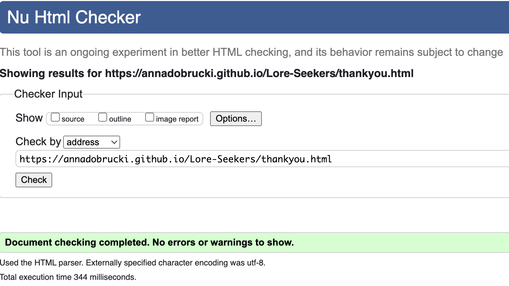

# Testing

## Index

 * [Error resolution and Debugging](#error-resolution-and-debugging)
 * [Responsiveness Testing](#responsiveness-testing)
 * [Lighthouse testing](#lighthouse-testing)
 * [HTML & CSS Validation](#html--css-validation)
 * [Browser compatibility](#browser-compatibility)

Through-out testing I found an array of bugs, however using [Dev Tools](https://developer.chrome.com/docs/devtools/) I found ways of debugging them. 

## Error Resolution and Debugging 

 1. I had a consistent problem of my hero image and footer borders changing shape when I was making the site responsive to other screen sizes. After some time I realised using %'s for both height and width, meant that if the screen got smaller so too would the curvature of the border. I then fixed the value to *em* and the border remains curved and responsive.

 2. I used Lighthouse to check my overall performance and accessability scores, whilst doing so, found a name error in one of my labels that hadn't been spotted and since fixed.

 3. In one of my earlier versions, my workshop badges were consistanly producing problems. Dev tools helped me realise that because of the size of the element itself I would have to use different CSS to place them where I wanted on the page. (Again) My mentor Gareth McGirr, pushed me to look at the 'Flex' attribute, giving me a helpful game called [Froggy](https://www.flexboxfroggy.com) to understand the method and implement it.

## Manual testing

## Responsiveness testing 
 
 Dev tools was my go to for understanding my sites responisveness, and correcting media quieries. My site is responsive for the below:
   * iPhone SE
   * iPhone XR
   * iPhone 12 Pro
   * Pixel 5
   * Samsung Galaxy S8+
   * Samsung Galaxy S20 Ultra
   * iPad Air
   * iPad Mini
   * Surface Pro 7
   * Surface Duo
   * Samsung Galaxy A51
   * Nest Hub
   * Nest Hub Max

  ## Lighthouse Testing 

  Below are the tests for all pages:
  + index.html
  

  + workshop.html 
  

  + joinin.html
  

  + thankyou.html
  

# HTML & CSS Validation

## HTML5

I used the [W3C Validation Service](https://validator.w3.org/#validate_by_input) to validate all HTML5 code used.

See Below:

  * [Index.html - press here to live link](https://validator.w3.org/nu/?doc=https%3A%2F%2Fannadobrucki.github.io%2FLore-Seekers%2Findex.html)

  

  * [Workshops.html - press here to live link](https://validator.w3.org/nu/?doc=https%3A%2F%2Fannadobrucki.github.io%2FLore-Seekers%2Fworkshops.html)

  

  * [Joinin.html - press here to live link](https://validator.w3.org/nu/?doc=https%3A%2F%2Fannadobrucki.github.io%2FLore-Seekers%2Fjoinin.html)

  

  * [Thankyou.html](https://validator.w3.org/nu/?doc=https%3A%2F%2Fannadobrucki.github.io%2FLore-Seekers%2Fthankyou.html)

  

  ## CSS3

  I used the [W3C Validation Service](https://jigsaw.w3.org/css-validator/#validate_by_input) to validate all CSS3 code used.

  See Below: 

  * CSS3 

## Browser Compatibility

This website has been tested on, *Safari*, *Chrome*, *Edge*, and *Firefox*.

[Return to READme.md](../README.md)

